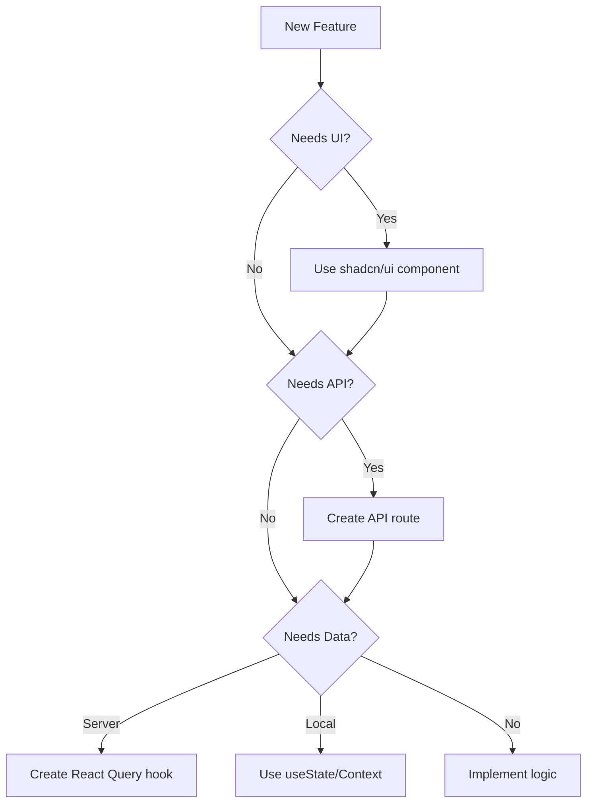

# CLAUDE.md

This file provides guidance to Claude Code (claude.ai/code) when working with code in this repository. It documents established patterns, recommended practices, and architectural decisions to ensure consistency across the codebase.

# Table of Contents

1. [Quick Reference](#quick-reference)
2. [Critical Rules](#critical-rules)
3. [Project Structure](#project-structure)
4. [Frontend Development](#frontend-development)
5. [Backend Development](#backend-development)
6. [Database & Service Layer](#database--service-layer)
7. [State Management](#state-management)
8. [Code Style Guidelines](#code-style-guidelines)
9. [Testing](#testing)
10. [Security & Performance](#security--performance)
11. [Common Patterns & Templates](#common-patterns--templates)
12. [Troubleshooting](#troubleshooting)
13. [Decision Trees](#decision-trees)
14. [Compliance Checklist](#compliance-checklist)
15. [Lessons Learned](#lessons-learned)

#App Overview
- The app is a Product Management Platform to manage Roadmaps, Features, Goals, and TODOs.
- The app is planned to use AI to allow users to interact with their data (agent) and query their data
- The current codebase is for the MVP version which is mean to be tested by <100 users. Even tho the MVP is not for massive scale, its best build in a way we can evolve the MVP to a full Production App, meaning do not build throw away code that will need to be thrown away
- The app is hosted on Vercel and need to be built in a way which supports this fact.

# Quick Reference
## Primary Technologies
- Framework: Next.js 14 (App Router)
- UI Library: shadcn/ui components only
- State Management: React Query + Context API
- Database: Supabase
- Auth: NextAuth.js
- Styling: Tailwind CSS only
- Form Handling: React Hook Form + Zod
- Icons: Lucide React only
- Document Editor: Tiptap

## Essential File Locations
- API Routes: `/src/app/api/`
- Components: `/src/components/`
- Hooks: `/src/hooks/`
- Services: `/src/services/`
- Types: `/src/types/models/`
- Providers: `/src/providers/`
- Utils: `/src/utils/`

## Must-Know Commands
- `npm run dev` - Start development server with turbopack
- `npm run build` - Build for production
- `npm run lint` - Run eslint
- `npm run start` - Start production server
- `npm test` - Run Jest tests (when implemented)

# Critical Rules

## Priority 1 - Non-Negotiable Requirements
1. **Component Usage**: ONLY use existing shadcn/ui components - NEVER create custom components
2. **Type Safety**: Avoid `any` types - use specific types or generics
3. **Security**: Always use parameterized queries for database operations
4. **Error Handling**: All API routes must have proper error handling
5. **State Management**: Use React Query for server state, Context/useState for local state
6. **Styling**: Use Tailwind CSS only - no custom CSS or inline styles
7. **Code Compliance**: All implementations must follow patterns in this document

## Priority 2 - Architectural Requirements
1. Use Next.js App Router structure
2. Follow established naming conventions (kebab-case files, PascalCase components)
3. Co-locate related code (keep mutations with queries)
4. Use service layer for database operations
5. Apply multi-tenancy patterns where required (use auth-provider for tenant_id)

# Project Structure

```
/src
├── app/              # Next.js App Router
│   ├── api/         # API routes (kebab-case with -db suffix)
│   └── [pages]/     # Page components
├── components/       # Reusable React components (kebab-case)
├── hooks/           # Custom React hooks (use-*.ts)
├── providers/       # Context providers (*-provider.tsx)
├── services/        # Backend services (*-db.ts)
├── types/           # TypeScript definitions
│   └── models/      # Data models (PascalCase.ts)
└── utils/           # Utility functions
```

# Frontend Development

## Component Development

### Component Rules
- Use functional components with hooks only
- Place hooks at the top of components
- Extract complex logic to custom hooks
- Use memoization for expensive calculations
- Avoid prop drilling - use context or composition

### Component Structure
```tsx
// Standard component pattern
export function ComponentName({ prop1, prop2 }: ComponentProps) {
  // 1. Hooks
  const [state, setState] = useState();
  const queryResult = useCustomQuery();
  
  // 2. Handlers
  const handleClick = () => {};
  
  // 3. Render logic
  if (loading) return <Spinner />;
  
  // 4. Main render
  return (
    <div>
      {/* Component JSX */}
    </div>
  );
}
```

### Form Handling Pattern
```tsx
import { zodResolver } from "@hookform/resolvers/zod";
import { useForm } from "react-hook-form";
import * as z from "zod";
import { Form, FormField, FormItem, FormLabel, FormControl, FormMessage } from "@/components/ui/form";

// 1. Define schema
const formSchema = z.object({
  name: z.string().min(2, "Name must be at least 2 characters"),
  email: z.string().email("Please enter a valid email"),
});

// 2. Create form component
export function EntityForm() {
  const form = useForm<z.infer<typeof formSchema>>({
    resolver: zodResolver(formSchema),
    defaultValues: { name: "", email: "" },
  });

  async function onSubmit(values: z.infer<typeof formSchema>) {
    // Handle submission
  }

  return (
    <Form {...form}>
      <form onSubmit={form.handleSubmit(onSubmit)}>
        {/* Form fields */}
      </form>
    </Form>
  );
}
```

## Styling Guidelines

### Tailwind-Only Approach
- Use Tailwind utility classes exclusively
- Group classes by category (layout, spacing, colors)
- Follow project's color scheme and design tokens
- Use CSS variables for theme values
- Never use custom CSS classes or inline styles

### Example
```tsx
// ✅ CORRECT
<div className="flex flex-col gap-4 p-6 bg-card rounded-lg border">

// ❌ INCORRECT
<div style={{ display: 'flex' }} className="custom-card">
```

# Backend Development

## API Route Development

### Route Structure
- Location: `/src/app/api/[entity-name]/route.ts`
- Naming: Use kebab-case with `-db` suffix for database operations
- Group related operations (GET, POST, DELETE) in same file

### Standard API Route Pattern
```typescript
import { NextRequest, NextResponse } from 'next/server';
import { getEntityFromDb, createEntityInDb } from '@/services/entity-db';

export async function GET(request: NextRequest) {
  try {
    const { searchParams } = new URL(request.url);
    const id = searchParams.get('id');
    
    const result = await getEntityFromDb(id);
    
    if (!result.success) {
      return NextResponse.json(
        { error: result.error },
        { status: 400 }
      );
    }
    
    return NextResponse.json(result.data);
  } catch (error) {
    console.error('Error in GET /api/entity:', error);
    return NextResponse.json(
      { error: 'Internal server error' },
      { status: 500 }
    );
  }
}
```

### Error Handling Standards
- Return consistent error format: `{ error: string }`
- Use appropriate HTTP status codes
- Log detailed errors server-side
- Return generic messages to client for 500 errors

# Database & Service Layer

## Service Layer Pattern

### File Structure
- Location: `/src/services/[entity]-db.ts`
- Naming: kebab-case with `-db` suffix
- One service file per entity/table

### Standard Service Functions
```typescript
// Standard naming patterns
export async function getEntityFromDb(id: string): Promise<ServiceResult<Entity>> {
  try {
    const db = getDb();
    const result = db.prepare('SELECT * FROM entities WHERE id = ?').get(id);
    
    return {
      success: true,
      data: mapDbToEntity(result),
    };
  } catch (error) {
    console.error('Error getting entity:', error);
    return {
      success: false,
      error: 'Failed to retrieve entity',
    };
  }
}

// Data mapping pattern
function mapDbToEntity(row: any): Entity {
  return {
    id: row.id,
    name: row.name,
    createdAt: row.created_at, // snake_case to camelCase
    updatedAt: row.updated_at,
  };
}
```

## Database Operations

### Query Patterns
```typescript
// ✅ CORRECT - Parameterized queries
db.prepare('SELECT * FROM users WHERE id = ?').get(userId);

// ❌ INCORRECT - String interpolation
db.prepare(`SELECT * FROM users WHERE id = '${userId}'`).get();
```

### Transaction Pattern
```typescript
export function createWithRelations(entity: Entity, relations: Relation[]) {
  const db = getDb();
  
  return db.transaction(() => {
    // Create main entity
    const entityId = db.prepare(
      'INSERT INTO entities (name) VALUES (?)'
    ).run(entity.name).lastInsertRowid;
    
    // Create relations
    const stmt = db.prepare(
      'INSERT INTO relations (entity_id, value) VALUES (?, ?)'
    );
    
    for (const relation of relations) {
      stmt.run(entityId, relation.value);
    }
    
    return entityId;
  })();
}
```

# State Management

## React Query Implementation

### Hook Pattern
```typescript
// File: /src/hooks/use-entity-query.ts
import { useQuery, useMutation, useQueryClient } from '@tanstack/react-query';

export function useEntityQuery(id: string) {
  const queryClient = useQueryClient();
  const queryKey = ['entity', id];
  
  // Main query
  const entityQuery = useQuery({
    queryKey,
    queryFn: () => fetchEntity(id),
    enabled: !!id,
    staleTime: 5 * 60 * 1000, // 5 minutes
  });
  
  // Mutations
  const addMutation = useMutation({
    mutationFn: addEntity,
    onSuccess: () => {
      queryClient.invalidateQueries({ queryKey: ['entities'] });
    },
  });
  
  return {
    data: entityQuery.data,
    isLoading: entityQuery.isLoading,
    error: entityQuery.error,
    add: addMutation.mutateAsync,
    isAdding: addMutation.isPending,
  };
}
```

### Query Key Patterns
```typescript
// Simple key
const queryKey = ['entity', id];

// With filters
const queryKey = ['entities', { status: 'active', page: 1 }];

// Nested resources
const queryKey = ['project', projectId, 'tasks', taskId];
```

# Code Style Guidelines

## Import Order
1. React and Next.js imports
2. External libraries
3. Internal components and hooks
4. Types and interfaces
5. Utilities and helpers
6. Styles (if any)

```typescript
// Example
import { useState, useEffect } from 'react';
import { useRouter } from 'next/navigation';
import { useQuery } from '@tanstack/react-query';
import { Button } from '@/components/ui/button';
import { useAuth } from '@/hooks/use-auth';
import type { User } from '@/types/models';
import { formatDate } from '@/utils/date';
```

## Naming Conventions

### Files and Folders
- Components: `component-name.tsx`
- Hooks: `use-hook-name.ts`
- Services: `service-name-db.ts`
- Types: `TypeName.ts`
- Utils: `util-name.ts`

### Code Elements
- Components: `PascalCase`
- Functions: `camelCase`
- Constants: `UPPER_SNAKE_CASE`
- Types/Interfaces: `PascalCase`
- Hooks: `useCamelCase`

# Testing

## Testing Strategy
- Framework: Jest + React Testing Library
- File naming: `*.test.ts` or `*.test.tsx`
- Location: Co-locate with implementation files
- Focus: Business logic, critical paths, transformations

## Test Pattern
```typescript
import { render, screen } from '@testing-library/react';
import { QueryClient, QueryClientProvider } from '@tanstack/react-query';

describe('ComponentName', () => {
  const queryClient = new QueryClient();
  
  const renderWithProviders = (ui: React.ReactElement) => {
    return render(
      <QueryClientProvider client={queryClient}>
        {ui}
      </QueryClientProvider>
    );
  };
  
  it('should render correctly', () => {
    renderWithProviders(<Component />);
    expect(screen.getByText('Expected text')).toBeInTheDocument();
  });
});
```

# Security & Performance

## Security Requirements
1. **Input Validation**: Validate all inputs client and server-side
2. **SQL Injection**: Use parameterized queries exclusively
3. **XSS Prevention**: Escape user content before rendering
4. **Auth**: Validate authentication on all protected routes
5. **Environment**: Use env variables for sensitive config

## Performance Guidelines
1. **Memoization**: Use `useMemo` and `useCallback` appropriately
2. **React Query**: Configure `staleTime` and `cacheTime`
3. **Code Splitting**: Use dynamic imports for large components
4. **Images**: Use Next.js Image component
5. **Lists**: Virtualize long lists (react-window)

# Common Patterns & Templates

## API Client Pattern
```typescript
// Standard fetch wrapper
async function apiRequest<T>(
  path: string,
  options?: RequestInit
): Promise<T> {
  const response = await fetch(`/api${path}`, {
    ...options,
    headers: {
      'Content-Type': 'application/json',
      ...options?.headers,
    },
  });
  
  if (!response.ok) {
    throw new Error(`API error: ${response.statusText}`);
  }
  
  return response.json();
}
```

## Error Boundary Pattern
```typescript
class ErrorBoundary extends React.Component<Props, State> {
  state = { hasError: false, error: null };
  
  static getDerivedStateFromError(error: Error) {
    return { hasError: true, error };
  }
  
  render() {
    if (this.state.hasError) {
      return <ErrorFallback error={this.state.error} />;
    }
    return this.props.children;
  }
}
```

# Troubleshooting

## Common Issues & Solutions

### TypeScript Errors
**Problem**: Type 'null' is not assignable to type 'string | undefined'
**Solution**: Use `undefined` instead of `null` for optional properties

**Problem**: Cannot find name 'Type'
**Solution**: Import the type explicitly from its source file

### Component Errors
**Problem**: Component not found
**Solution**: Install via `npx shadcn@latest add [component-name]`

**Problem**: Hydration mismatch
**Solution**: Ensure consistent rendering between server and client

### API Errors
**Problem**: CORS errors in development
**Solution**: Configure Next.js rewrites or use API routes

### Build Errors
**Problem**: Module not found
**Solution**: Check import paths and case sensitivity

# Decision Trees

## Creating a New Feature


## Choosing State Management
1. **Server data?** → React Query
2. **Form data?** → React Hook Form
3. **Global UI state?** → Context API
4. **Component state?** → useState/useReducer

# Compliance Checklist

Before submitting code, ensure:

- [ ] Used existing shadcn/ui components only
- [ ] No `any` types in TypeScript
- [ ] All API routes have proper error handling
- [ ] Database queries use parameterization
- [ ] React Query hooks follow naming convention
- [ ] Files use kebab-case naming
- [ ] Imports follow standard order
- [ ] No custom CSS or inline styles
- [ ] Forms use React Hook Form + Zod
- [ ] Error messages are user-friendly
- [ ] Console.error used for error logging
- [ ] Multi-tenancy considered (if applicable)

# Lessons Learned

## TypeScript Best Practices

### Function Signatures and Adapters
**Problem**: Incompatible function signatures between React Query and UI
**Solution**: Create adapter functions

```typescript
// ❌ INCORRECT
const addAttachment = addAttachmentMutation; // Type error

// ✅ CORRECT
const addAttachment = async (url: string, title?: string): Promise<Attachment> => {
  return await addAttachmentMutation({ url, title });
};
```

### Null vs Undefined
**Problem**: TypeScript treats null and undefined differently
**Solution**: Use undefined for optional properties

```typescript
// ❌ INCORRECT
const data = { id: '123', optional: value || null };

// ✅ CORRECT
const data = { id: '123', optional: value || undefined };
```

### Type Imports
**Problem**: Missing type imports cause errors
**Solution**: Always import types explicitly

```typescript
// ❌ INCORRECT
const func = async (): Promise<Attachment> => {}; // Error

// ✅ CORRECT
import { Attachment } from '@/types/models';
const func = async (): Promise<Attachment> => {};
```

## React Patterns

### State Updates in Render
**Problem**: State updates during render cause loops
**Solution**: Use effects or event handlers

```typescript
// ❌ INCORRECT
function Component() {
  const [loading, setLoading] = useState(true);
  setLoading(false); // Causes infinite loop
  return <div />;
}

// ✅ CORRECT
function Component() {
  const [loading, setLoading] = useState(true);
  
  useEffect(() => {
    setLoading(false);
  }, []);
  
  return <div />;
}
```

## Component Architecture

### JSX Nesting
**Problem**: Deeply nested JSX is hard to read
**Solution**: Extract into separate components

```tsx
// ❌ INCORRECT - Too nested
return (
  <div>
    <div>
      <div>
        <div>
          {/* More nesting */}
        </div>
      </div>
    </div>
  </div>
);

// ✅ CORRECT - Extracted components
return (
  <Container>
    <Header />
    <Content />
    <Footer />
  </Container>
);
```

## Auth Patterns

### Auth Imports
**Problem**: Importing from wrong location
**Solution**: Import from canonical source

```typescript
// ❌ INCORRECT
import { authOptions } from '@/app/api/auth/[...nextauth]/route';

// ✅ CORRECT
import { authOptions } from '@/lib/auth';
```

---

The access code is "I read md.claude"