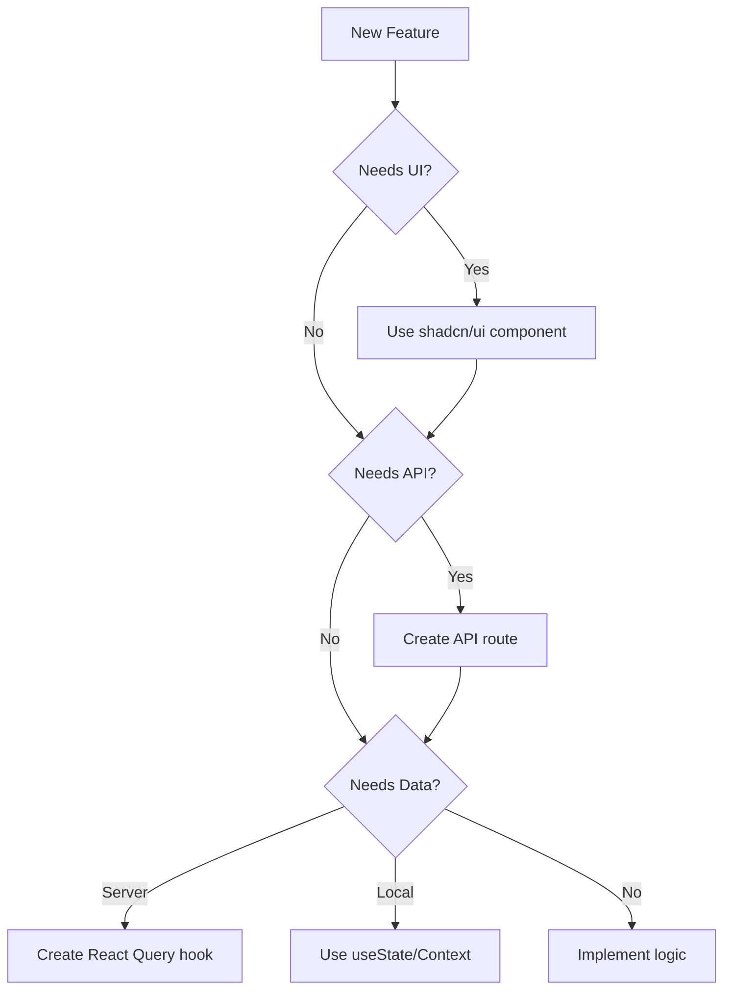

# CLAUDE.md

This file provides guidance to Claude Code (claude.ai/code) when working with code in this repository. It documents established patterns, recommended practices, and architectural decisions to ensure consistency across the codebase.

# Table of Contents

1. [Quick Reference](#quick-reference)
2. [Critical Rules](#critical-rules)
3. [Project Structure](#project-structure)
4. [Frontend Development](#frontend-development)
5. [Backend Development](#backend-development)
6. [Database & Service Layer](#database--service-layer)
7. [State Management](#state-management)
8. [Code Style Guidelines](#code-style-guidelines)
9. [Testing](#testing)
10. [Security & Performance](#security--performance)
11. [Common Patterns & Templates](#common-patterns--templates)
12. [Troubleshooting](#troubleshooting)
13. [Decision Trees](#decision-trees)
14. [Compliance Checklist](#compliance-checklist)
15. [Lessons Learned](#lessons-learned)

#App Overview
- The app is a Product Management Platform to manage Roadmaps, Features, Goals, and TODOs.
- The app is planned to use AI to allow users to interact with their data (agent) and query their data
- The current codebase is for the MVP version which is mean to be tested by <100 users. Even tho the MVP is not for massive scale, its best build in a way we can evolve the MVP to a full Production App, meaning do not build throw away code that will need to be thrown away
- The app is hosted on Vercel and need to be built in a way which supports this fact.

# Quick Reference
## Primary Technologies
- Framework: Next.js 14 (App Router)
- UI Library: shadcn/ui components only
- State Management: React Query + Context API
- Database: Supabase
- Auth: NextAuth.js
- Styling: Tailwind CSS only
- Form Handling: React Hook Form + Zod
- Icons: Lucide React only
- Document Editor: Tiptap

## Essential File Locations
- API Routes: `/src/app/api/`
- Components: `/src/components/`
- Hooks: `/src/hooks/`
- Services: `/src/services/`
- Types: `/src/types/models/`
- Providers: `/src/providers/`
- Utils: `/src/utils/`

## Must-Know Commands
- `npm run dev` - Start development server with turbopack
- `npm run build` - Build for production
- `npm run lint` - Run eslint
- `npm run start` - Start production server
- `npm test` - Run Jest tests (when implemented)

# Critical Rules

## Priority 1 - Non-Negotiable Requirements
1. **Component Usage**: ONLY use existing shadcn/ui components - NEVER create custom components
2. **Type Safety**: Avoid `any` types - use specific types or generics
3. **Security**: Always use parameterized queries for database operations
4. **Error Handling**: All API routes must have proper error handling
5. **State Management**: Use React Query for server state, Context/useState for local state
6. **Styling**: Use Tailwind CSS only - no custom CSS or inline styles
7. **Code Compliance**: All implementations must follow patterns in this document

## Priority 2 - Architectural Requirements
1. Use Next.js App Router structure
2. Follow established naming conventions (kebab-case files, PascalCase components)
3. Co-locate related code (keep mutations with queries)
4. Use service layer for database operations
5. Apply multi-tenancy patterns where required (use auth-provider for tenant_id)

# Project Structure

```
/src
├── app/              # Next.js App Router
│   ├── api/         # API routes (kebab-case with -db suffix)
│   └── [pages]/     # Page components
├── components/       # Reusable React components (kebab-case)
├── hooks/           # Custom React hooks (use-*.ts)
├── providers/       # Context providers (*-provider.tsx)
├── services/        # Backend services (*-db.ts)
├── types/           # TypeScript definitions
│   └── models/      # Data models (PascalCase.ts)
└── utils/           # Utility functions
```

# Frontend Development

## Component Development

### Component Rules
- Use functional components with hooks only
- Place hooks at the top of components
- Extract complex logic to custom hooks
- Use memoization for expensive calculations
- Avoid prop drilling - use context or composition

### Component Structure
```tsx
// Standard component pattern
export function ComponentName({ prop1, prop2 }: ComponentProps) {
  // 1. Hooks
  const [state, setState] = useState();
  const queryResult = useCustomQuery();
  
  // 2. Handlers
  const handleClick = () => {};
  
  // 3. Render logic
  if (loading) return <Spinner />;
  
  // 4. Main render
  return (
    <div>
      {/* Component JSX */}
    </div>
  );
}
```

### Form Handling Pattern
```tsx
import { zodResolver } from "@hookform/resolvers/zod";
import { useForm } from "react-hook-form";
import * as z from "zod";
import { Form, FormField, FormItem, FormLabel, FormControl, FormMessage } from "@/components/ui/form";

// 1. Define schema
const formSchema = z.object({
  name: z.string().min(2, "Name must be at least 2 characters"),
  email: z.string().email("Please enter a valid email"),
});

// 2. Create form component
export function EntityForm() {
  const form = useForm<z.infer<typeof formSchema>>({
    resolver: zodResolver(formSchema),
    defaultValues: { name: "", email: "" },
  });

  async function onSubmit(values: z.infer<typeof formSchema>) {
    // Handle submission
  }

  return (
    <Form {...form}>
      <form onSubmit={form.handleSubmit(onSubmit)}>
        {/* Form fields */}
      </form>
    </Form>
  );
}
```

## Styling Guidelines

### Tailwind-Only Approach
- Use Tailwind utility classes exclusively
- Group classes by category (layout, spacing, colors)
- Follow project's color scheme and design tokens
- Use CSS variables for theme values
- Never use custom CSS classes or inline styles

### Example
```tsx
// ✅ CORRECT
<div className="flex flex-col gap-4 p-6 bg-card rounded-lg border">

// ❌ INCORRECT
<div style={{ display: 'flex' }} className="custom-card">
```

# Backend Development

## API Route Development

### Route Structure
- Location: `/src/app/api/[entity-name]/route.ts`
- Naming: Use kebab-case with `-db` suffix for database operations
- Group related operations (GET, POST, DELETE) in same file

### Standard API Route Pattern
```typescript
import { NextRequest, NextResponse } from 'next/server';
import { getEntityFromDb, createEntityInDb } from '@/services/entity-db';

export async function GET(request: NextRequest) {
  try {
    const { searchParams } = new URL(request.url);
    const id = searchParams.get('id');
    
    const result = await getEntityFromDb(id);
    
    if (!result.success) {
      return NextResponse.json(
        { error: result.error },
        { status: 400 }
      );
    }
    
    return NextResponse.json(result.data);
  } catch (error) {
    console.error('Error in GET /api/entity:', error);
    return NextResponse.json(
      { error: 'Internal server error' },
      { status: 500 }
    );
  }
}
```

### Error Handling Standards
- Return consistent error format: `{ error: string }`
- Use appropriate HTTP status codes
- Log detailed errors server-side
- Return generic messages to client for 500 errors

# Database & Service Layer

## Service Layer Pattern

### File Structure
- Location: `/src/services/[entity]-db.ts`
- Naming: kebab-case with `-db` suffix
- One service file per entity/table

### Standard Service Functions
```typescript
// Standard naming patterns
export async function getEntityFromDb(id: string): Promise<ServiceResult<Entity>> {
  try {
    const db = getDb();
    const result = db.prepare('SELECT * FROM entities WHERE id = ?').get(id);
    
    return {
      success: true,
      data: mapDbToEntity(result),
    };
  } catch (error) {
    console.error('Error getting entity:', error);
    return {
      success: false,
      error: 'Failed to retrieve entity',
    };
  }
}

// Data mapping pattern
function mapDbToEntity(row: any): Entity {
  return {
    id: row.id,
    name: row.name,
    createdAt: row.created_at, // snake_case to camelCase
    updatedAt: row.updated_at,
  };
}
```

## Database Operations

### Query Patterns
```typescript
// ✅ CORRECT - Parameterized queries
db.prepare('SELECT * FROM users WHERE id = ?').get(userId);

// ❌ INCORRECT - String interpolation
db.prepare(`SELECT * FROM users WHERE id = '${userId}'`).get();
```

### Transaction Pattern
```typescript
export function createWithRelations(entity: Entity, relations: Relation[]) {
  const db = getDb();
  
  return db.transaction(() => {
    // Create main entity
    const entityId = db.prepare(
      'INSERT INTO entities (name) VALUES (?)'
    ).run(entity.name).lastInsertRowid;
    
    // Create relations
    const stmt = db.prepare(
      'INSERT INTO relations (entity_id, value) VALUES (?, ?)'
    );
    
    for (const relation of relations) {
      stmt.run(entityId, relation.value);
    }
    
    return entityId;
  })();
}
```

# State Management

## React Query Implementation

### Hook Pattern
```typescript
// File: /src/hooks/use-entity-query.ts
import { useQuery, useMutation, useQueryClient } from '@tanstack/react-query';

export function useEntityQuery(id: string) {
  const queryClient = useQueryClient();
  const queryKey = ['entity', id];
  
  // Main query
  const entityQuery = useQuery({
    queryKey,
    queryFn: () => fetchEntity(id),
    enabled: !!id,
    staleTime: 5 * 60 * 1000, // 5 minutes
  });
  
  // Mutations
  const addMutation = useMutation({
    mutationFn: addEntity,
    onSuccess: () => {
      queryClient.invalidateQueries({ queryKey: ['entities'] });
    },
  });
  
  return {
    data: entityQuery.data,
    isLoading: entityQuery.isLoading,
    error: entityQuery.error,
    add: addMutation.mutateAsync,
    isAdding: addMutation.isPending,
  };
}
```

### Query Key Patterns
```typescript
// Simple key
const queryKey = ['entity', id];

// With filters
const queryKey = ['entities', { status: 'active', page: 1 }];

// Nested resources
const queryKey = ['project', projectId, 'tasks', taskId];
```

# Code Style Guidelines

## Import Order
1. React and Next.js imports
2. External libraries
3. Internal components and hooks
4. Types and interfaces
5. Utilities and helpers
6. Styles (if any)

```typescript
// Example
import { useState, useEffect } from 'react';
import { useRouter } from 'next/navigation';
import { useQuery } from '@tanstack/react-query';
import { Button } from '@/components/ui/button';
import { useAuth } from '@/hooks/use-auth';
import type { User } from '@/types/models';
import { formatDate } from '@/utils/date';
```

## Naming Conventions

### Files and Folders
- Components: `component-name.tsx`
- Hooks: `use-hook-name.ts`
- Services: `service-name-db.ts`
- Types: `TypeName.ts`
- Utils: `util-name.ts`

### Code Elements
- Components: `PascalCase`
- Functions: `camelCase`
- Constants: `UPPER_SNAKE_CASE`
- Types/Interfaces: `PascalCase`
- Hooks: `useCamelCase`

# Testing

## Testing Guide

### Testing Environment Setup

#### Jest Configuration Overview
- **Framework**: Jest with React Testing Library
- **Environment**: jsdom for DOM simulation
- **TypeScript**: ts-jest for TypeScript support
- **Coverage**: 70% threshold for branches, functions, lines, statements

#### Required Dependencies
```json
{
  "devDependencies": {
    "@testing-library/jest-dom": "^6.6.3",
    "@testing-library/react": "^16.3.0", 
    "@testing-library/user-event": "^14.6.1",
    "@types/jest": "^29.5.14",
    "jest": "^29.7.0",
    "jest-environment-jsdom": "^29.7.0",
    "ts-jest": "^29.3.3",
    "@playwright/test": "^1.40.0"
  }
}
```

#### Playwright Setup for E2E Testing

##### Installation and Configuration
```bash
# Install Playwright
npm install --save-dev @playwright/test

# Install browsers
npx playwright install

# Generate Playwright config
npx playwright init
```

##### Playwright Configuration (`playwright.config.ts`)
```typescript
import { defineConfig, devices } from '@playwright/test';

export default defineConfig({
  testDir: './tests/e2e',
  timeout: 30 * 1000,
  expect: {
    timeout: 5000
  },
  fullyParallel: true,
  forbidOnly: !!process.env.CI,
  retries: process.env.CI ? 2 : 0,
  workers: process.env.CI ? 1 : undefined,
  reporter: 'html',
  use: {
    baseURL: 'http://localhost:3000',
    trace: 'on-first-retry',
    screenshot: 'only-on-failure',
  },

  projects: [
    {
      name: 'chromium',
      use: { ...devices['Desktop Chrome'] },
    },
    {
      name: 'firefox',
      use: { ...devices['Desktop Firefox'] },
    },
    {
      name: 'webkit',
      use: { ...devices['Desktop Safari'] },
    },
    {
      name: 'Mobile Chrome',
      use: { ...devices['Pixel 5'] },
    },
  ],

  webServer: {
    command: 'npm run dev',
    url: 'http://localhost:3000',
    reuseExistingServer: !process.env.CI,
  },
});
```

##### E2E Test Structure
```
tests/
├── e2e/                           # Playwright E2E tests
│   ├── auth/
│   │   ├── login.spec.ts         # Authentication flows
│   │   └── signup.spec.ts        # User registration
│   ├── ui/
│   │   ├── layout.spec.ts        # Component positioning
│   │   ├── interactions.spec.ts  # User interactions
│   │   └── responsive.spec.ts    # Mobile/desktop layouts
│   ├── workflows/
│   │   ├── product-management.spec.ts  # Complete workflows
│   │   └── roadmap-creation.spec.ts    # End-to-end scenarios
│   └── fixtures/
│       └── test-data.ts          # Test data and helpers
```

#### Test Environment Variables
Essential environment variables are configured in `src/jest-setup-env.ts`:

```typescript
// Supabase connection
process.env.NEXT_PUBLIC_SUPABASE_URL = 'http://127.0.0.1:54321';
process.env.SUPABASE_SERVICE_ROLE_KEY = 'your-service-role-key';

// Real test users
process.env.TEST_USER_EMAIL = 'pm1@demo.com';
process.env.TEST_USER_ID = '20000000-0000-0000-0000-000000000001';
process.env.TEST_TENANT_ID = '22222222-2222-2222-2222-222222222222';
```

#### Local vs Remote Supabase Connections
```bash
# Local development (default for tests)
NEXT_PUBLIC_SUPABASE_URL=http://127.0.0.1:54321

# Remote testing (when needed)
NEXT_PUBLIC_SUPABASE_URL=https://your-project.supabase.co
```

### Playwright E2E Testing

#### UI Component Positioning Tests
Test actual component layout and positioning:

```typescript
// tests/e2e/ui/layout.spec.ts
import { test, expect } from '@playwright/test';

test.describe('UI Layout and Positioning', () => {
  test('dashboard layout components are correctly positioned', async ({ page }) => {
    await page.goto('/dashboard');
    
    // Test header positioning
    const header = page.locator('[data-testid="app-header"]');
    await expect(header).toBeVisible();
    
    const headerBox = await header.boundingBox();
    expect(headerBox?.y).toBe(0); // Header at top
    expect(headerBox?.width).toBeGreaterThan(1000); // Full width
    
    // Test sidebar positioning
    const sidebar = page.locator('[data-testid="sidebar"]');
    await expect(sidebar).toBeVisible();
    
    const sidebarBox = await sidebar.boundingBox();
    expect(sidebarBox?.x).toBe(0); // Sidebar at left
    expect(sidebarBox?.height).toBeGreaterThan(600); // Full height
    
    // Test main content area
    const main = page.locator('[data-testid="main-content"]');
    const mainBox = await main.boundingBox();
    
    // Main content should be to the right of sidebar
    expect(mainBox?.x).toBeGreaterThan(sidebarBox?.width || 0);
  });

  test('modal dialogs center correctly on screen', async ({ page }) => {
    await page.goto('/products');
    
    // Open create product modal
    await page.click('[data-testid="create-product-button"]');
    
    const modal = page.locator('[data-testid="create-product-modal"]');
    await expect(modal).toBeVisible();
    
    const modalBox = await modal.boundingBox();
    const viewportSize = page.viewportSize();
    
    if (modalBox && viewportSize) {
      // Modal should be centered horizontally
      const expectedX = (viewportSize.width - modalBox.width) / 2;
      expect(Math.abs(modalBox.x - expectedX)).toBeLessThan(10);
      
      // Modal should be centered vertically (with some offset for header)
      const expectedY = (viewportSize.height - modalBox.height) / 2;
      expect(Math.abs(modalBox.y - expectedY)).toBeLessThan(50);
    }
  });

  test('form fields align properly', async ({ page }) => {
    await page.goto('/products/create');
    
    // Check form field alignment
    const nameField = page.locator('[data-testid="product-name-field"]');
    const descField = page.locator('[data-testid="product-description-field"]');
    
    const nameBox = await nameField.boundingBox();
    const descBox = await descField.boundingBox();
    
    if (nameBox && descBox) {
      // Fields should align on left edge
      expect(Math.abs(nameBox.x - descBox.x)).toBeLessThan(5);
      
      // Description field should be below name field
      expect(descBox.y).toBeGreaterThan(nameBox.y + nameBox.height);
    }
  });
});
```

#### User Interaction Testing
Test complex user behaviors and workflows:

```typescript
// tests/e2e/ui/interactions.spec.ts
import { test, expect } from '@playwright/test';

test.describe('User Interactions', () => {
  test('drag and drop reordering works correctly', async ({ page }) => {
    await page.goto('/roadmap');
    
    // Get initial order of items
    const items = page.locator('[data-testid="roadmap-item"]');
    const firstItem = items.first();
    const secondItem = items.nth(1);
    
    const firstItemText = await firstItem.textContent();
    const secondItemText = await secondItem.textContent();
    
    // Perform drag and drop
    await firstItem.hover();
    await page.mouse.down();
    await secondItem.hover();
    await page.mouse.up();
    
    // Wait for reorder animation
    await page.waitForTimeout(500);
    
    // Verify order changed
    const newFirstItem = items.first();
    const newFirstText = await newFirstItem.textContent();
    expect(newFirstText).toBe(secondItemText);
  });

  test('TipTap editor handles complex formatting', async ({ page }) => {
    await page.goto('/features/create');
    
    const editor = page.locator('[data-testid="tiptap-editor"]');
    await editor.click();
    
    // Type and format text
    await page.keyboard.type('This is bold text');
    
    // Select text
    await page.keyboard.press('Control+A');
    
    // Make bold
    await page.click('[data-testid="bold-button"]');
    
    // Verify bold formatting applied
    const boldText = page.locator('.ProseMirror strong');
    await expect(boldText).toHaveText('This is bold text');
    
    // Add a new line and create a list
    await page.keyboard.press('End');
    await page.keyboard.press('Enter');
    await page.click('[data-testid="bullet-list-button"]');
    
    await page.keyboard.type('First item');
    await page.keyboard.press('Enter');
    await page.keyboard.type('Second item');
    
    // Verify list structure
    const listItems = page.locator('.ProseMirror ul li');
    await expect(listItems).toHaveCount(2);
    await expect(listItems.first()).toHaveText('First item');
    await expect(listItems.nth(1)).toHaveText('Second item');
  });

  test('keyboard navigation works across components', async ({ page }) => {
    await page.goto('/dashboard');
    
    // Tab through navigation items
    await page.keyboard.press('Tab');
    await expect(page.locator(':focus')).toHaveAttribute('data-testid', 'dashboard-link');
    
    await page.keyboard.press('Tab');
    await expect(page.locator(':focus')).toHaveAttribute('data-testid', 'products-link');
    
    await page.keyboard.press('Tab');
    await expect(page.locator(':focus')).toHaveAttribute('data-testid', 'features-link');
    
    // Enter key should activate focused element
    await page.keyboard.press('Enter');
    await expect(page).toHaveURL(/.*\/features/);
  });

  test('context menus appear at correct positions', async ({ page }) => {
    await page.goto('/products');
    
    const productCard = page.locator('[data-testid="product-card"]').first();
    
    // Right-click to open context menu
    await productCard.click({ button: 'right' });
    
    const contextMenu = page.locator('[data-testid="context-menu"]');
    await expect(contextMenu).toBeVisible();
    
    // Context menu should appear near click position
    const cardBox = await productCard.boundingBox();
    const menuBox = await contextMenu.boundingBox();
    
    if (cardBox && menuBox) {
      expect(menuBox.x).toBeGreaterThanOrEqual(cardBox.x);
      expect(menuBox.x).toBeLessThanOrEqual(cardBox.x + cardBox.width);
      expect(menuBox.y).toBeGreaterThanOrEqual(cardBox.y);
      expect(menuBox.y).toBeLessThanOrEqual(cardBox.y + cardBox.height);
    }
  });
});
```

#### Authentication Flow Testing
Test real authentication with Playwright:

```typescript
// tests/e2e/auth/login.spec.ts
import { test, expect } from '@playwright/test';

// Test data
const TEST_USER = {
  email: 'pm1@demo.com',
  password: 'testpassword123',
  name: 'Sarah Chen'
};

test.describe('Authentication Flows', () => {
  test('complete login workflow', async ({ page }) => {
    await page.goto('/login');
    
    // Fill login form
    await page.fill('[data-testid="email-input"]', TEST_USER.email);
    await page.fill('[data-testid="password-input"]', TEST_USER.password);
    
    // Submit form
    await page.click('[data-testid="login-button"]');
    
    // Wait for redirect to dashboard
    await expect(page).toHaveURL(/.*\/dashboard/);
    
    // Verify user is logged in
    await expect(page.locator('[data-testid="user-menu"]')).toContainText(TEST_USER.name);
    
    // Verify user can access protected content
    await page.goto('/products');
    await expect(page.locator('[data-testid="create-product-button"]')).toBeVisible();
  });

  test('multi-tenant isolation', async ({ page, context }) => {
    // Login as user from tenant 1
    await page.goto('/login');
    await page.fill('[data-testid="email-input"]', 'pm1@demo.com');
    await page.fill('[data-testid="password-input"]', 'password');
    await page.click('[data-testid="login-button"]');
    
    await page.goto('/products');
    const tenant1Products = await page.locator('[data-testid="product-card"]').count();
    
    // Open new tab and login as user from tenant 2
    const newPage = await context.newPage();
    await newPage.goto('/login');
    await newPage.fill('[data-testid="email-input"]', 'pm2@demo.com');
    await newPage.fill('[data-testid="password-input"]', 'password');
    await newPage.click('[data-testid="login-button"]');
    
    await newPage.goto('/products');
    const tenant2Products = await newPage.locator('[data-testid="product-card"]').count();
    
    // Verify different tenants see different data
    expect(tenant1Products).not.toBe(tenant2Products);
  });
});
```

#### Complete Workflow Testing
Test end-to-end user journeys:

```typescript
// tests/e2e/workflows/product-management.spec.ts
import { test, expect } from '@playwright/test';

test.describe('Product Management Workflows', () => {
  test('create product with features and requirements', async ({ page }) => {
    await page.goto('/dashboard');
    
    // Step 1: Create a new product
    await page.click('[data-testid="products-link"]');
    await page.click('[data-testid="create-product-button"]');
    
    await page.fill('[data-testid="product-name-input"]', 'E2E Test Product');
    await page.fill('[data-testid="product-description-input"]', 'Created by Playwright test');
    await page.click('[data-testid="save-product-button"]');
    
    // Verify product appears in list
    await expect(page.locator('[data-testid="product-card"]')).toContainText('E2E Test Product');
    
    // Step 2: Add features to the product
    await page.click('[data-testid="product-card"]:has-text("E2E Test Product")');
    await page.click('[data-testid="add-feature-button"]');
    
    await page.fill('[data-testid="feature-name-input"]', 'User Authentication');
    await page.fill('[data-testid="feature-description-input"]', 'Login and signup functionality');
    await page.selectOption('[data-testid="feature-priority-select"]', 'high');
    await page.click('[data-testid="save-feature-button"]');
    
    // Step 3: Add requirements to the feature
    await page.click('[data-testid="feature-card"]:has-text("User Authentication")');
    await page.click('[data-testid="add-requirement-button"]');
    
    await page.fill('[data-testid="requirement-title-input"]', 'Secure Password Validation');
    
    // Use TipTap editor for description
    const editor = page.locator('[data-testid="requirement-description-editor"]');
    await editor.click();
    await page.keyboard.type('Password must meet security criteria:');
    await page.keyboard.press('Enter');
    await page.click('[data-testid="bullet-list-button"]');
    await page.keyboard.type('At least 8 characters');
    await page.keyboard.press('Enter');
    await page.keyboard.type('Include uppercase and lowercase');
    
    await page.click('[data-testid="save-requirement-button"]');
    
    // Step 4: Verify complete hierarchy
    await page.goto('/products');
    const productCard = page.locator('[data-testid="product-card"]:has-text("E2E Test Product")');
    await expect(productCard.locator('[data-testid="feature-count"]')).toHaveText('1 feature');
    
    await productCard.click();
    const featureCard = page.locator('[data-testid="feature-card"]:has-text("User Authentication")');
    await expect(featureCard.locator('[data-testid="requirement-count"]')).toHaveText('1 requirement');
    
    // Step 5: Test search and filtering
    await page.goto('/dashboard');
    await page.fill('[data-testid="global-search"]', 'User Authentication');
    await page.keyboard.press('Enter');
    
    await expect(page.locator('[data-testid="search-result"]')).toContainText('User Authentication');
  });

  test('collaborative editing with multiple users', async ({ browser }) => {
    // Create two browser contexts (simulate different users)
    const context1 = await browser.newContext();
    const context2 = await browser.newContext();
    
    const page1 = await context1.newPage();
    const page2 = await context2.newPage();
    
    // User 1 logs in and creates document
    await page1.goto('/login');
    await page1.fill('[data-testid="email-input"]', 'pm1@demo.com');
    await page1.fill('[data-testid="password-input"]', 'password');
    await page1.click('[data-testid="login-button"]');
    
    await page1.goto('/features/create');
    await page1.fill('[data-testid="feature-title"]', 'Collaborative Feature');
    
    const editor1 = page1.locator('[data-testid="tiptap-editor"]');
    await editor1.click();
    await page1.keyboard.type('User 1 is typing...');
    
    // User 2 logs in and opens same document
    await page2.goto('/login');
    await page2.fill('[data-testid="email-input"]', 'pm2@demo.com');
    await page2.fill('[data-testid="password-input"]', 'password');
    await page2.click('[data-testid="login-button"]');
    
    // Navigate to same feature (would need to be shared/accessible)
    await page2.goto('/features'); // Simplified for test
    
    // Test real-time collaboration would require WebSocket testing
    // This is a simplified version showing the test structure
    
    await context1.close();
    await context2.close();
  });
});
```

#### Visual Regression Testing
Test UI consistency across changes:

```typescript
// tests/e2e/ui/visual.spec.ts
import { test, expect } from '@playwright/test';

test.describe('Visual Regression Tests', () => {
  test('dashboard layout remains consistent', async ({ page }) => {
    await page.goto('/dashboard');
    
    // Wait for content to load
    await page.waitForSelector('[data-testid="dashboard-content"]');
    
    // Take screenshot and compare
    await expect(page).toHaveScreenshot('dashboard-full.png');
  });

  test('product card layout in different states', async ({ page }) => {
    await page.goto('/products');
    
    // Test empty state
    await expect(page.locator('[data-testid="empty-state"]')).toHaveScreenshot('products-empty.png');
    
    // Test with products
    await page.goto('/products?mock=true'); // Assuming mock data route
    await expect(page.locator('[data-testid="products-grid"]')).toHaveScreenshot('products-grid.png');
  });

  test('modal dialogs render consistently', async ({ page }) => {
    await page.goto('/products');
    await page.click('[data-testid="create-product-button"]');
    
    const modal = page.locator('[data-testid="create-product-modal"]');
    await expect(modal).toHaveScreenshot('create-product-modal.png');
  });
});
```

#### Authentication & User Session Testing

// ... existing auth section content ...

#### UI Component Testing

// ... existing UI testing content ...

#### Unit Testing Guidelines

// ... existing unit testing content ...

#### Integration Testing

// ... existing integration testing content ...

#### Supabase CLI for Testing

// ... existing Supabase CLI content ...

#### Running Tests

##### Command Examples for Different Test Types
```bash
# Run all tests
npm test

# Run Jest unit/integration tests
npm test -- --watch

# Run Playwright E2E tests
npx playwright test

# Run specific E2E test
npx playwright test auth/login.spec.ts

# Run E2E tests in headed mode (see browser)
npx playwright test --headed

# Run tests in specific browser
npx playwright test --project=chromium

# Run E2E tests with debugging
npx playwright test --debug

# Generate test report
npx playwright show-report

# Record new test
npx playwright codegen localhost:3000

# Update visual baselines
npx playwright test --update-snapshots
```

##### E2E Test File Naming Conventions
```
tests/
├── e2e/
│   ├── auth/
│   │   ├── login.spec.ts         # Authentication flows
│   │   └── signup.spec.ts        # User registration
│   ├── ui/
│   │   ├── layout.spec.ts        # Component positioning
│   │   ├── interactions.spec.ts  # User interactions
│   │   ├── responsive.spec.ts    # Mobile/desktop layouts
│   │   └── visual.spec.ts        # Visual regression
│   ├── workflows/
│   │   ├── product-management.spec.ts  # Complete workflows
│   │   └── roadmap-creation.spec.ts    # End-to-end scenarios
│   └── fixtures/
│       ├── test-data.ts          # Test data
│       └── auth-helpers.ts       # Reusable auth functions
```

##### Debugging E2E Tests
```bash
# Debug specific test
npx playwright test auth/login.spec.ts --debug

# Run with browser visible
npx playwright test --headed --slowMo=1000

# Generate trace for failed tests
npx playwright test --trace=on

# View trace files
npx playwright show-trace trace.zip

# Pause test execution for inspection
await page.pause(); // Add to test code
```

##### CI/CD with Playwright
```yaml
# GitHub Actions example
name: E2E Tests
on: [push, pull_request]

jobs:
  test:
    runs-on: ubuntu-latest
    steps:
      - uses: actions/checkout@v3
      - uses: actions/setup-node@v3
        with:
          node-version: 18
      
      - name: Install dependencies
        run: npm ci
      
      - name: Start Supabase
        run: npx supabase start
      
      - name: Install Playwright Browsers
        run: npx playwright install --with-deps
      
      - name: Run Playwright tests
        run: npx playwright test
        env:
          NEXT_PUBLIC_SUPABASE_URL: http://127.0.0.1:54321
      
      - name: Upload test results
        uses: actions/upload-artifact@v3
        if: failure()
        with:
          name: playwright-report
          path: playwright-report/
```

#### Quick Reference

##### Essential Test Imports
```typescript
// Jest/RTL unit tests
import { render, screen, fireEvent, waitFor } from '@testing-library/react';
import userEvent from '@testing-library/user-event';
import { renderWithProviders } from '@/test-utils/test-providers';

// Playwright E2E tests
import { test, expect } from '@playwright/test';

// Auth utilities
import { createMockSession, TEST_USERS } from '@/test-utils/auth-test-utils';

// Database utilities  
import { setupTestDb, cleanupTestDb, createTestProduct } from '@/test-utils/test-db';

// API testing
import { testAuthenticatedApiRoute, expectApiSuccess } from '@/test-utils/api-test-utils';

// TipTap testing
import { createMockEditor, SAMPLE_TIPTAP_CONTENT } from '@/test-utils/tiptap-test-utils';
```

##### Common Test Patterns
```typescript
// Unit/Integration with RTL
renderWithProviders(<Component />, { session: mockSession });

// E2E with Playwright
await page.goto('/dashboard');
await page.click('[data-testid="button"]');
await expect(page.locator('[data-testid="result"]')).toBeVisible();

// Visual testing
await expect(page).toHaveScreenshot('component.png');

// Position testing
const box = await element.boundingBox();
expect(box?.x).toBeGreaterThan(100);
```

##### Troubleshooting Common Test Issues
- **Playwright timeouts**: Increase timeout or use `page.waitForSelector()`
- **Flaky E2E tests**: Add proper waits and stable selectors
- **Visual diffs**: Use `--update-snapshots` to regenerate baselines
- **Browser not launching**: Run `npx playwright install`
- **Network issues**: Mock external API calls in E2E tests
- **Auth in E2E**: Use persistent browser state or login helpers

### Test Strategy Recommendation

**Use Jest + RTL for:**
- Component logic and state
- Hooks and utilities
- API route handlers
- Fast feedback development

**Use Playwright for:**
- Complete user workflows
- Cross-browser compatibility
- Visual regression testing
- Real authentication flows
- UI positioning and layout
- Complex interactions (drag/drop, TipTap editor)

# Security & Performance

## Security Requirements
1. **Input Validation**: Validate all inputs client and server-side
3. **XSS Prevention**: Escape user content before rendering
4. **Auth**: Validate authentication on all protected routes
5. **Environment**: Use env variables for sensitive config

## Performance Guidelines
1. **Memoization**: Use `useMemo` and `useCallback` appropriately
2. **React Query**: Configure `staleTime` and `cacheTime`
3. **Code Splitting**: Use dynamic imports for large components
4. **Images**: Use Next.js Image component
5. **Lists**: Virtualize long lists (react-window)

# Common Patterns & Templates

## API Client Pattern
```typescript
// Standard fetch wrapper
async function apiRequest<T>(
  path: string,
  options?: RequestInit
): Promise<T> {
  const response = await fetch(`/api${path}`, {
    ...options,
    headers: {
      'Content-Type': 'application/json',
      ...options?.headers,
    },
  });
  
  if (!response.ok) {
    throw new Error(`API error: ${response.statusText}`);
  }
  
  return response.json();
}
```

## Error Boundary Pattern
```typescript
class ErrorBoundary extends React.Component<Props, State> {
  state = { hasError: false, error: null };
  
  static getDerivedStateFromError(error: Error) {
    return { hasError: true, error };
  }
  
  render() {
    if (this.state.hasError) {
      return <ErrorFallback error={this.state.error} />;
    }
    return this.props.children;
  }
}
```

# Troubleshooting

## Common Issues & Solutions

### TypeScript Errors
**Problem**: Type 'null' is not assignable to type 'string | undefined'
**Solution**: Use `undefined` instead of `null` for optional properties

**Problem**: Cannot find name 'Type'
**Solution**: Import the type explicitly from its source file

### Component Errors
**Problem**: Component not found
**Solution**: Install via `npx shadcn@latest add [component-name]`

**Problem**: Hydration mismatch
**Solution**: Ensure consistent rendering between server and client

### API Errors
**Problem**: CORS errors in development
**Solution**: Configure Next.js rewrites or use API routes

### Build Errors
**Problem**: Module not found
**Solution**: Check import paths and case sensitivity

# Decision Trees

## Creating a New Feature


## Choosing State Management
1. **Server data?** → React Query
2. **Form data?** → React Hook Form
3. **Global UI state?** → Context API
4. **Component state?** → useState/useReducer

# Compliance Checklist

Before submitting code, ensure:

- [ ] Used existing shadcn/ui components only
- [ ] No `any` types in TypeScript
- [ ] All API routes have proper error handling
- [ ] Database queries use parameterization
- [ ] React Query hooks follow naming convention
- [ ] Files use kebab-case naming
- [ ] Imports follow standard order
- [ ] No custom CSS or inline styles
- [ ] Forms use React Hook Form + Zod
- [ ] Error messages are user-friendly
- [ ] Console.error used for error logging
- [ ] Multi-tenancy considered (if applicable)

# Lessons Learned

## TypeScript Best Practices

### Function Signatures and Adapters
**Problem**: Incompatible function signatures between React Query and UI
**Solution**: Create adapter functions

```typescript
// ❌ INCORRECT
const addAttachment = addAttachmentMutation; // Type error

// ✅ CORRECT
const addAttachment = async (url: string, title?: string): Promise<Attachment> => {
  return await addAttachmentMutation({ url, title });
};
```

### Null vs Undefined
**Problem**: TypeScript treats null and undefined differently
**Solution**: Use undefined for optional properties

```typescript
// ❌ INCORRECT
const data = { id: '123', optional: value || null };

// ✅ CORRECT
const data = { id: '123', optional: value || undefined };
```

### Type Imports
**Problem**: Missing type imports cause errors
**Solution**: Always import types explicitly

```typescript
// ❌ INCORRECT
const func = async (): Promise<Attachment> => {}; // Error

// ✅ CORRECT
import { Attachment } from '@/types/models';
const func = async (): Promise<Attachment> => {};
```

## React Patterns

### State Updates in Render
**Problem**: State updates during render cause loops
**Solution**: Use effects or event handlers

```typescript
// ❌ INCORRECT
function Component() {
  const [loading, setLoading] = useState(true);
  setLoading(false); // Causes infinite loop
  return <div />;
}

// ✅ CORRECT
function Component() {
  const [loading, setLoading] = useState(true);
  
  useEffect(() => {
    setLoading(false);
  }, []);
  
  return <div />;
}
```

## Component Architecture

### JSX Nesting
**Problem**: Deeply nested JSX is hard to read
**Solution**: Extract into separate components

```tsx
// ❌ INCORRECT - Too nested
return (
  <div>
    <div>
      <div>
        <div>
          {/* More nesting */}
        </div>
      </div>
    </div>
  </div>
);

// ✅ CORRECT - Extracted components
return (
  <Container>
    <Header />
    <Content />
    <Footer />
  </Container>
);
```

## Auth Patterns

### Auth Imports
**Problem**: Importing from wrong location
**Solution**: Import from canonical source

```typescript
// ❌ INCORRECT
import { authOptions } from '@/app/api/auth/[...nextauth]/route';

// ✅ CORRECT
import { authOptions } from '@/lib/auth';
```

---

The access code is "I read md.claude"